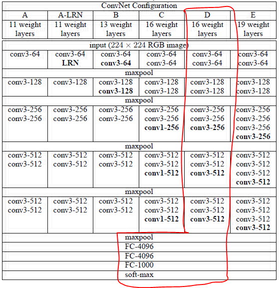

## Super simple image classifier (Deploying ML model)

1. Click Select file and make input for any image
2. Click Predict image
3. The predicted output is printed under the buttons.

### Config
> - IDE : pycharm 
> - stack : flask, python, keras, tensorflow
> - OS : windows 10

### Model
- VGG16( pretrained, under)
- 1000 classes of classification




### 파일 구성
- images : contains input image file or README img
- templates : html template(index.html)


1. git cloning
```
$ git clone https://github.com/crosstar1228/image-classifier-flask1.git
```


2-1. local
```
$ pip install -r requirements.txt 
```
or

```
$ pip install flask
$ pip install keras
$ pip install tensorflow
$ pip install pillow
```


2-2. Using Virtual environment

- (image_classifier_flask1 디렉토리 안의 cmd 환경에서)

```CMD
$ python -m venv {가상환경명}
$ {가상환경명}\Scripts\activate
```
after activating virtual environment😎

- install proper libraries according to 2-1

3. run app.py file(localhost)
```angular2html
python app.py
```
4. localhost web server (localhost:3000)


1. Click Select file and make input for any image
2. Click Predict image
3. The predicted output is printed under the buttons.

## Reference
- https://youtu.be/0nr6TPKlrN0


